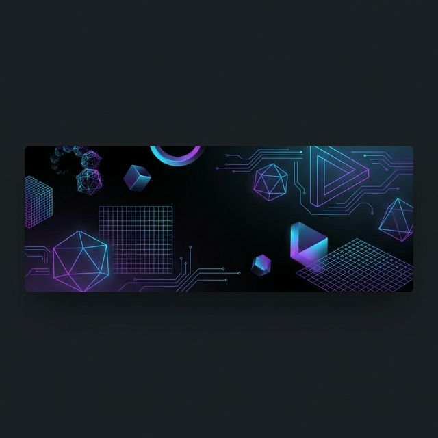
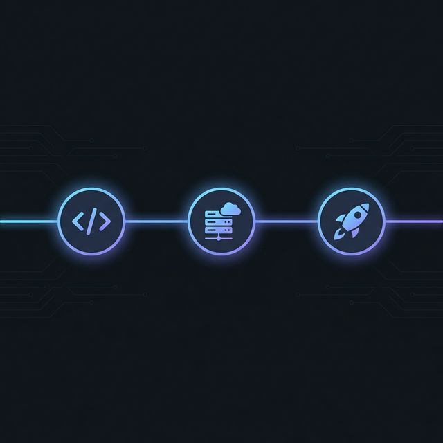

<div align="center">

  

  # Hi there, I'm Algiras! 👋

  ### 🚀 Passionate Software Engineer & Architect

  I'm a developer who loves building robust, scalable systems and crafting beautiful user experiences. Currently focusing on **Rust**, **AI Integration**, and **Modern web apps**.

  ---

  <div style="display: flex; justify-content: center; gap: 10px; margin-bottom: 20px;">
    <a href="https://github.com/Algiras">
      
    </a>
    <a href="https://linkedin.com/in/algiras">
      
    </a>
    <a href="mailto:algimantask@wix.com">
      
    </a>
    <a href="https://algiras.github.io/">
      
    </a>
  </div>

  <div align="center">
    <b>Location:</b> Vilnius, Lithuania &nbsp;|&nbsp;
    <b>Company:</b> @Wix &nbsp;|&nbsp;
    <b>Languages:</b> English, Lithuanian, German
  </div>
  <div align="center">
    <b>Focus:</b> AI tooling, MCP servers, RAG systems, knowledge graphs
  </div>

  <br/>

</div>

## 💼 Professional Journey

<div align="center">
  <picture>
    <source media="(prefers-color-scheme: dark)" srcset="professional-journey-dark.png">
    <source media="(prefers-color-scheme: light)" srcset="professional-journey-light.png">
    
  </picture>
</div>

<br />

### 🏢 Software Engineer @ [Wix](https://wix.com)
_2025 - Present_
> Building AI developer tools, scaling backend services, and architecting RAG systems.

### 📈 Financial Analyst
_2021_
> Certification in Financial Analysis & Time Value of Money.

### 🚀 Functional Programming & Scala
_2018_
> Specialized in functional programming paradigms and Scala development.

### 🎮 Unity Game Developer
_2014 - 2015_
> Developed interactive experiences and contributed to volunteer projects.

### 🎓 Computer Science @ [KTU](https://ktu.edu)
_2009 - 2013_
> Bachelor's degree in Informatics.

---

## Featured Projects

<table>
<tr>
<td width="50%" valign="top">

### [skillz](https://github.com/Algiras/skillz)
**Self-extending MCP server** — Build and execute custom AI tools at runtime.

<p>
  
  
  
</p>

`Rust` `AI` `MCP`

</td>
<td width="50%" valign="top">

### [rusty-pageindex](https://github.com/Algiras/rusty-pageindex)
**Structure-aware RAG indexing** — High-performance document indexing for retrieval-augmented generation.

<p>
  
  
  
</p>

`Rust` `RAG` `Search`

</td>
</tr>

<tr>
<td width="50%" valign="top">

### [RKnowledge](https://github.com/Algiras/RKnowledge)
**Knowledge graph builder** — Extract concepts and relationships from documents with LLM-powered indexing.

<p>
  
  
</p>

`Rust` `Neo4j` `LLM`

</td>
<td width="50%" valign="top">

### [Algiras.github.io](https://github.com/Algiras/Algiras.github.io)
**Portfolio & Financial Tools** — Interactive calculators, document tools, and games.

<p>
  
  
</p>

`React` `TypeScript` `Mantine`

</td>
</tr>

<tr>
<td width="50%" valign="top">

### [embedeval](https://github.com/Algiras/embedeval)
**LLM Evaluation Framework** — Binary judgment framework emphasizing pass/fail over subjective scoring.

<p>
  
  
</p>

`TypeScript` `Testing` `LLM`

</td>
<td width="50%" valign="top">

### [wolf-saga](https://github.com/Algiras/wolf-saga)
**Gelezižio Vilko Saga** — Epic dark fantasy about 14th century Lithuania.

[Read Online](https://algiras.github.io/wolf-saga/) | [Audiobook](https://www.youtube.com/watch?v=7FTLqyPXSr0)

`Python` `Creative Writing` `AI`

</td>
</tr>
</table>

---

## 🛠️ Tech Stack

<div style="display: flex; flex-wrap: wrap; justify-content: center; gap: 10px;">
  
  
  
  
  
  
  
  
  
  
</div>

<br/>

## Current Focus

<div align="center">
  
</div>

```rust
impl Developer for Algimantas {
    fn current_interests(&self) -> Vec<Focus> {
        vec![
            Focus::Rust { areas: vec!["Systems", "RAG", "MCP Servers"] },
            Focus::AI { tools: vec!["LLMs", "Embeddings", "Knowledge Graphs"] },
            Focus::WebDev { stack: vec!["React", "TypeScript", "Mantine"] },
            Focus::Research { topics: vec!["Recursion Schemes", "FP"] },
        ]
    }
}
```

---

## Highlights

<div align="center">
  
  
  
  
</div>

<div align="center">

| | Project | Description | Links |
|---|---------|-------------|-------|
| **Wolf Saga** | Gelezinio Vilko Saga | Epic dark fantasy — 14th century Lithuania | [Read](https://algiras.github.io/wolf-saga/) · [Audio](https://www.youtube.com/watch?v=7FTLqyPXSr0) |
| **Extremism Analysis** | Comparative Study | 200-page analysis using AI | [Research](https://github.com/Algiras/the-shadow-of-extremism) |
| **Memory Palace** | Knowledge Retention | Method of loci technique | [Repo](https://github.com/Algiras/memory-palace) |
| **QMD Search** | CLI Search Engine | Local-first document search | [Repo](https://github.com/Algiras/qmd) |

</div>

---

## 📊 GitHub Stats

<div style="display: flex; justify-content: center; gap: 20px; flex-wrap: wrap;">
  
  
</div>

<br/>

<div align="center">
  
</div>

<br/>

<div align="center">
  <picture>
    <source media="(prefers-color-scheme: dark)" srcset="https://raw.githubusercontent.com/Algiras/Algiras/output/github-contribution-grid-snake-dark.svg">
    <source media="(prefers-color-scheme: light)" srcset="https://raw.githubusercontent.com/Algiras/Algiras/output/github-contribution-grid-snake.svg">
    
  </picture>
</div>

<br/>

<div align="center">
  <picture>
    <source media="(prefers-color-scheme: dark)" srcset="https://capsule-render.vercel.app/api?type=waving&color=gradient&customColorList=12,14,20&height=100&section=footer">
    <source media="(prefers-color-scheme: light)" srcset="https://capsule-render.vercel.app/api?type=waving&color=gradient&customColorList=2,12,14&height=100&section=footer">
    
  </picture>
</div>
