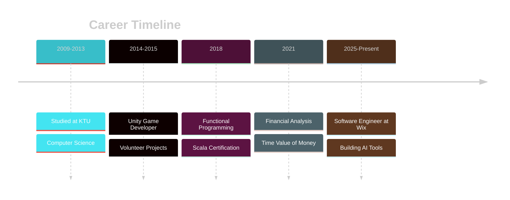

<div align="center">

<!-- Animated Header Banner -->


<!-- Typing Animation -->
<a href="https://git.io/typing-svg">
  
</a>

<!-- Animated Wave -->


<!-- Social Badges with Hover Effects -->
<p>
  <a href="https://www.linkedin.com/in/asimplek/">
    
  </a>
  <a href="https://algiras.github.io/">
    
  </a>
  <a href="https://github.com/Algiras">
    
  </a>
</p>

<!-- Profile Views Counter with Animation -->


</div>

---

<!-- About Me Section with Animated Gradient -->


### 👨‍💻 About Me

```typescript
const algimantas = {
  pronouns: "he" | "him",
  location: "📍 Vilnius, Lithuania",
  company: "🏢 @Wix",
  languages: {
    spoken: ["🇬🇧 English", "🇱🇹 Lithuanian", "🇩🇪 German"],
    programming: ["Rust", "TypeScript", "Python", "Scala"]
  },
  currentFocus: [
    "🦀 Rust systems programming & RAG",
    "🤖 AI/LLM tooling (MCP servers)",
    "🧠 Knowledge graphs & semantic search",
    "📚 Local-first applications"
  ],
  funFact: "Built an epic dark fantasy saga about 14th century Lithuania! 🐺",
  motto: "Building tools that amplify human potential 💡"
};
```

<br clear="right"/>

---

## 🚀 Featured Projects

<div align="center">

<!-- Project Cards with Hover Effects -->
<table>
<tr>
<td width="50%" valign="top">

### 🤖 [skillz](https://github.com/Algiras/skillz) ⭐ 31


**Self-extending MCP server** - Build and execute custom AI tools at runtime. Dynamic AI capabilities framework.

<code></code>
<code></code>

</td>
<td width="50%" valign="top">

### 📄 [rusty-pageindex](https://github.com/Algiras/rusty-pageindex) ⭐ 9


**Structure-aware RAG indexing** - High-performance document indexing system for retrieval-augmented generation.

<code></code>
<code></code>

</td>
</tr>

<tr>
<td width="50%" valign="top">

### 🧠 [RKnowledge](https://github.com/Algiras/RKnowledge) ⭐ 2


**Knowledge graph builder** - Extract concepts and relationships from documents with LLM-powered indexing.

<code></code>
<code></code>

</td>
<td width="50%" valign="top">

### 💼 [Algiras.github.io](https://github.com/Algiras/Algiras.github.io)


**Portfolio & Financial Tools** - Interactive calculators, document tools, and games. React + TypeScript + Mantine.

<code></code>
<code></code>

</td>
</tr>

<tr>
<td width="50%" valign="top">

### 📊 [embedeval](https://github.com/Algiras/embedeval) ⭐ 2


**LLM Evaluation Framework** - Binary judgment framework emphasizing pass/fail over subjective scoring.

<code></code>
<code></code>

</td>
<td width="50%" valign="top">

### 🐺 [wolf-saga](https://github.com/Algiras/wolf-saga)


**Geležinio Vilko Saga** - Epic dark fantasy about 14th century Lithuania. [📖 Read](https://algiras.github.io/wolf-saga/) | [🎧 Audio](https://www.youtube.com/watch?v=7FTLqyPXSr0)

<code></code>
<code></code>

</td>
</tr>
</table>

</div>

---

## 💻 Tech Stack & Tools

<div align="center">

### Programming Languages


### Frontend Development


### Backend & Tools


### AI/ML & Data


</div>

---

## 📊 GitHub Statistics

<div align="center">

<!-- Main Stats -->


<!-- Most Used Languages -->


</div>

<div align="center">

<!-- Streak Stats -->


<!-- Contribution Graph -->


</div>

<div align="center">

<!-- Trophy Stats -->


</div>

---

## 💼 Professional Journey

<div align="center">



</div>

### 🏢 Current Role
**Software Engineer @ Wix** | Vilnius, Lithuania
Building scalable web solutions and AI-powered developer tools

### 🎓 Education
**Kauno Technologijos Universitetas (KTU)** | 2009-2013
Computer Science & Engineering

### 📜 Certifications
- 📊 **Advanced & Introduction to Time Value of Money** - Coursera (2021)
- 🔧 **Functional Programming in Scala** - Coursera (2018)
- 🐍 **Data Science in Python** - Coursera (2017)
- 🔐 **Security & Emerging Technologies** - Pluralsight

---

## 🎯 Current Focus

<div align="center">


</div>

```rust
impl Developer for Algimantas {
    fn current_interests(&self) -> Vec<Focus> {
        vec![
            Focus::Rust {
                areas: vec!["Systems Programming", "RAG", "MCP Servers"]
            },
            Focus::AI {
                tools: vec!["LLMs", "Embeddings", "Knowledge Graphs"]
            },
            Focus::WebDev {
                stack: vec!["React", "TypeScript", "Mantine"]
            },
            Focus::Research {
                topics: vec!["Recursion Schemes", "Functional Programming"]
            },
        ]
    }

    fn current_learning(&self) -> &str {
        "Building the future of AI-native developer tools 🚀"
    }
}
```

---

## 🌍 Community & Open Source

<div align="center">

<table>
<tr>
<td align="center" width="33%">

**👥 Community**
703 followers
500+ connections

</td>
<td align="center" width="33%">

**⭐ Stars Earned**


</td>
<td align="center" width="33%">

**🔧 Public Repos**


</td>
</tr>
</table>

</div>

---

## 🌱 Currently Exploring

<details>
<summary><b>🔍 Click to expand learning roadmap</b></summary>

<br>

- 🦀 **Advanced Rust**
  - Zero-cost abstractions
  - Async runtime optimization
  - WebAssembly compilation

- 🤖 **AI/ML Engineering**
  - Model Context Protocol (MCP)
  - Retrieval-Augmented Generation (RAG)
  - Vector databases & embeddings
  - LLM fine-tuning & evaluation

- 🧠 **Knowledge Systems**
  - Graph databases (Neo4j)
  - Semantic search algorithms
  - Document understanding & extraction

- 📚 **Functional Programming**
  - Recursion schemes (catamorphisms, anamorphisms)
  - Category theory applications
  - Effect systems

</details>

---

## 🎨 Side Projects & Creative Work

<div align="center">

| Project | Description | Link |
|---------|-------------|------|
| 🐺 **Wolf Saga** | Epic dark fantasy about 14th century Lithuania | [Read Online](https://algiras.github.io/wolf-saga/) • [Audiobook](https://www.youtube.com/watch?v=7FTLqyPXSr0) |
| 📚 **Extremism Analysis** | 200-page comparative study using AI | [View Research](https://github.com/Algiras/the-shadow-of-extremism) |
| 🧠 **Memory Palace** | Knowledge retention tool using method of loci | [Try It](https://github.com/Algiras/memory-palace) |
| 🔍 **QMD Search** | Local-first CLI search engine | [Documentation](https://github.com/Algiras/qmd) |

</div>

---

## 📫 Let's Connect!

<div align="center">

<a href="https://www.linkedin.com/in/asimplek/">
  
</a>
<a href="https://algiras.github.io/">
  
</a>
<a href="mailto:your-email@example.com">
  
</a>

<br><br>

<!-- Animated Quote -->


<br>

<!-- Snake Animation eating contributions -->
<picture>
  <source media="(prefers-color-scheme: dark)" srcset="https://raw.githubusercontent.com/Algiras/Algiras/output/github-contribution-grid-snake-dark.svg">
  <source media="(prefers-color-scheme: light)" srcset="https://raw.githubusercontent.com/Algiras/Algiras/output/github-contribution-grid-snake.svg">
  
</picture>

<br><br>

<!-- Footer Wave -->


</div>
