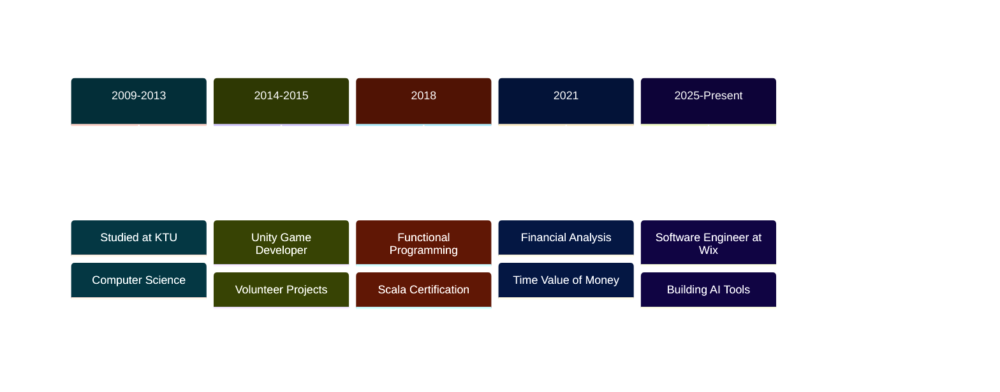

<div align="center">

<!-- Animated Header Banner -->
<picture>
  <source media="(prefers-color-scheme: dark)" srcset="https://capsule-render.vercel.app/api?type=waving&color=gradient&customColorList=12,14,20&height=200&section=header&text=Algimantas%20Krasnauskas&fontSize=50&fontColor=fff&animation=twinkling&fontAlignY=35&desc=Software%20Engineer%20%7C%20Rust%20%26%20TypeScript%20Enthusiast&descAlignY=55&descSize=18">
  <source media="(prefers-color-scheme: light)" srcset="https://capsule-render.vercel.app/api?type=waving&color=gradient&customColorList=2,12,14&height=200&section=header&text=Algimantas%20Krasnauskas&fontSize=50&fontColor=1a1b27&animation=twinkling&fontAlignY=35&desc=Software%20Engineer%20%7C%20Rust%20%26%20TypeScript%20Enthusiast&descAlignY=55&descSize=18">
  
</picture>

<!-- Typing Animation -->
<a href="https://git.io/typing-svg">
  
</a>

<br>

<!-- Social Badges -->
<a href="https://www.linkedin.com/in/asimplek/">
  
</a>
<a href="https://algiras.github.io/">
  
</a>
<a href="https://github.com/Algiras">
  
</a>

<br>


</div>

---

<!-- About Me Section -->


### About Me

&nbsp;

- **Location:** Vilnius, Lithuania
- **Company:** @Wix
- **Languages:** English, Lithuanian, German
- **Programming:** Rust, TypeScript, Python, Scala
- **Focus:** AI tooling, MCP servers, RAG systems, knowledge graphs
- **Fun fact:** Built an epic dark fantasy saga about 14th century Lithuania!

&nbsp;

<br clear="right"/>

---

## Featured Projects

<table>
<tr>
<td width="50%" valign="top">

### [skillz](https://github.com/Algiras/skillz)
**Self-extending MCP server** — Build and execute custom AI tools at runtime.

<p>
  
  
  
</p>

`Rust` `AI` `MCP`

</td>
<td width="50%" valign="top">

### [rusty-pageindex](https://github.com/Algiras/rusty-pageindex)
**Structure-aware RAG indexing** — High-performance document indexing for retrieval-augmented generation.

<p>
  
  
  
</p>

`Rust` `RAG` `Search`

</td>
</tr>

<tr>
<td width="50%" valign="top">

### [RKnowledge](https://github.com/Algiras/RKnowledge)
**Knowledge graph builder** — Extract concepts and relationships from documents with LLM-powered indexing.

<p>
  
  
</p>

`Rust` `Neo4j` `LLM`

</td>
<td width="50%" valign="top">

### [Algiras.github.io](https://github.com/Algiras/Algiras.github.io)
**Portfolio & Financial Tools** — Interactive calculators, document tools, and games.

<p>
  
  
</p>

`React` `TypeScript` `Mantine`

</td>
</tr>

<tr>
<td width="50%" valign="top">

### [embedeval](https://github.com/Algiras/embedeval)
**LLM Evaluation Framework** — Binary judgment framework emphasizing pass/fail over subjective scoring.

<p>
  
  
</p>

`TypeScript` `Testing` `LLM`

</td>
<td width="50%" valign="top">

### [wolf-saga](https://github.com/Algiras/wolf-saga)
**Gelezinio Vilko Saga** — Epic dark fantasy about 14th century Lithuania.

[Read Online](https://algiras.github.io/wolf-saga/) | [Audiobook](https://www.youtube.com/watch?v=7FTLqyPXSr0)

`Python` `Creative Writing` `AI`

</td>
</tr>
</table>

---

## Tech Stack

<div align="center">

**Languages**
<br>
<picture>
  <source media="(prefers-color-scheme: dark)" srcset="https://skillicons.dev/icons?i=rust,typescript,python,javascript,scala&theme=dark">
  <source media="(prefers-color-scheme: light)" srcset="https://skillicons.dev/icons?i=rust,typescript,python,javascript,scala&theme=light">
  
</picture>

**Frontend**
<br>
<picture>
  <source media="(prefers-color-scheme: dark)" srcset="https://skillicons.dev/icons?i=react,vite,tailwind,html,css&theme=dark">
  <source media="(prefers-color-scheme: light)" srcset="https://skillicons.dev/icons?i=react,vite,tailwind,html,css&theme=light">
  
</picture>

**Backend & DevOps**
<br>
<picture>
  <source media="(prefers-color-scheme: dark)" srcset="https://skillicons.dev/icons?i=nodejs,docker,git,github,postgres,linux,bash&theme=dark">
  <source media="(prefers-color-scheme: light)" srcset="https://skillicons.dev/icons?i=nodejs,docker,git,github,postgres,linux,bash&theme=light">
  
</picture>

**AI/ML**
<br>
<picture>
  <source media="(prefers-color-scheme: dark)" srcset="https://skillicons.dev/icons?i=pytorch,tensorflow&theme=dark">
  <source media="(prefers-color-scheme: light)" srcset="https://skillicons.dev/icons?i=pytorch,tensorflow&theme=light">
  
</picture>


</div>

---

## GitHub Statistics

<div align="center">

<picture>
  <source media="(prefers-color-scheme: dark)" srcset="https://github-readme-streak-stats.herokuapp.com/?user=Algiras&theme=tokyonight&hide_border=true&background=0D1117&ring=38BEC9&fire=38BEC9&currStreakLabel=38BEC9&sideNums=C9D1D9&currStreakNum=38BEC9&sideLabels=C9D1D9&dates=C9D1D9">
  <source media="(prefers-color-scheme: light)" srcset="https://github-readme-streak-stats.herokuapp.com/?user=Algiras&hide_border=true&ring=0891b2&fire=0891b2&currStreakLabel=0891b2&sideNums=334155&currStreakNum=0891b2&sideLabels=334155&dates=64748b">
  
</picture>
<picture>
  <source media="(prefers-color-scheme: dark)" srcset="https://github-profile-summary-cards.vercel.app/api/cards/stats?username=Algiras&theme=tokyonight">
  <source media="(prefers-color-scheme: light)" srcset="https://github-profile-summary-cards.vercel.app/api/cards/stats?username=Algiras&theme=default">
  
</picture>

</div>

<div align="center">

<picture>
  <source media="(prefers-color-scheme: dark)" srcset="https://github-readme-activity-graph.vercel.app/graph?username=Algiras&theme=tokyo-night&hide_border=true&bg_color=0D1117&color=38BEC9&line=38BEC9&point=C9D1D9&area=true&custom_title=Contribution+Graph">
  <source media="(prefers-color-scheme: light)" srcset="https://github-readme-activity-graph.vercel.app/graph?username=Algiras&theme=minimal&hide_border=true&color=0891b2&line=0891b2&point=334155&area=true&custom_title=Contribution+Graph">
  
</picture>

</div>

<details>
<summary><b>More Metrics</b></summary>

<br>

<div align="center">

<picture>
  <source media="(prefers-color-scheme: dark)" srcset="https://github-profile-summary-cards.vercel.app/api/cards/profile-details?username=Algiras&theme=tokyonight">
  <source media="(prefers-color-scheme: light)" srcset="https://github-profile-summary-cards.vercel.app/api/cards/profile-details?username=Algiras&theme=default">
  
</picture>

<picture>
  <source media="(prefers-color-scheme: dark)" srcset="https://github-profile-summary-cards.vercel.app/api/cards/repos-per-language?username=Algiras&theme=tokyonight">
  <source media="(prefers-color-scheme: light)" srcset="https://github-profile-summary-cards.vercel.app/api/cards/repos-per-language?username=Algiras&theme=default">
  
</picture>
<picture>
  <source media="(prefers-color-scheme: dark)" srcset="https://github-profile-summary-cards.vercel.app/api/cards/productive-time?username=Algiras&theme=tokyonight">
  <source media="(prefers-color-scheme: light)" srcset="https://github-profile-summary-cards.vercel.app/api/cards/productive-time?username=Algiras&theme=default">
  
</picture>

</div>

</details>

---

## Professional Journey

<div align="center">



</div>

**Software Engineer @ Wix** · Vilnius, Lithuania — Scalable web solutions & AI-powered developer tools

**KTU** · 2009-2013 — Computer Science & Engineering

<details>
<summary><b>Certifications</b></summary>

- **Advanced & Introduction to Time Value of Money** — Coursera (2021)
- **Functional Programming in Scala** — Coursera (2018)
- **Data Science in Python** — Coursera (2017)
- **Security & Emerging Technologies** — Pluralsight

</details>

---

## Current Focus

<div align="center">


</div>

```rust
impl Developer for Algimantas {
    fn current_interests(&self) -> Vec<Focus> {
        vec![
            Focus::Rust { areas: vec!["Systems", "RAG", "MCP Servers"] },
            Focus::AI { tools: vec!["LLMs", "Embeddings", "Knowledge Graphs"] },
            Focus::WebDev { stack: vec!["React", "TypeScript", "Mantine"] },
            Focus::Research { topics: vec!["Recursion Schemes", "FP"] },
        ]
    }
}
```

---

## Highlights

<div align="center">


</div>

<div align="center">

| | Project | Description | Links |
|---|---------|-------------|-------|
| **Wolf Saga** | Gelezinio Vilko Saga | Epic dark fantasy — 14th century Lithuania | [Read](https://algiras.github.io/wolf-saga/) · [Audio](https://www.youtube.com/watch?v=7FTLqyPXSr0) |
| **Extremism Analysis** | Comparative Study | 200-page analysis using AI | [Research](https://github.com/Algiras/the-shadow-of-extremism) |
| **Memory Palace** | Knowledge Retention | Method of loci technique | [Repo](https://github.com/Algiras/memory-palace) |
| **QMD Search** | CLI Search Engine | Local-first document search | [Repo](https://github.com/Algiras/qmd) |

</div>

<details>
<summary><b>Learning Roadmap</b></summary>

<br>

- **Advanced Rust** — Zero-cost abstractions, async runtimes, WebAssembly
- **AI/ML** — MCP servers, RAG architectures, vector databases, LLM eval
- **Knowledge Systems** — Graph databases (Neo4j), semantic search, document extraction
- **Functional Programming** — Recursion schemes, category theory, effect systems

</details>

---

## Let's Connect

<div align="center">

<a href="https://www.linkedin.com/in/asimplek/">
  
</a>
<a href="https://algiras.github.io/">
  
</a>

<br><br>

<picture>
  <source media="(prefers-color-scheme: dark)" srcset="https://quotes-github-readme.vercel.app/api?type=horizontal&theme=tokyonight&border=true&quote=Building+tools+that+amplify+human+potential&author=Algimantas+Krasnauskas">
  <source media="(prefers-color-scheme: light)" srcset="https://quotes-github-readme.vercel.app/api?type=horizontal&theme=default&border=true&quote=Building+tools+that+amplify+human+potential&author=Algimantas+Krasnauskas">
  
</picture>

<br>

<!-- Snake Animation -->
<picture>
  <source media="(prefers-color-scheme: dark)" srcset="https://raw.githubusercontent.com/Algiras/Algiras/output/github-contribution-grid-snake-dark.svg">
  <source media="(prefers-color-scheme: light)" srcset="https://raw.githubusercontent.com/Algiras/Algiras/output/github-contribution-grid-snake.svg">
  
</picture>

<br><br>

<!-- Footer -->
<picture>
  <source media="(prefers-color-scheme: dark)" srcset="https://capsule-render.vercel.app/api?type=waving&color=gradient&customColorList=12,14,20&height=100&section=footer">
  <source media="(prefers-color-scheme: light)" srcset="https://capsule-render.vercel.app/api?type=waving&color=gradient&customColorList=2,12,14&height=100&section=footer">
  
</picture>

</div>
